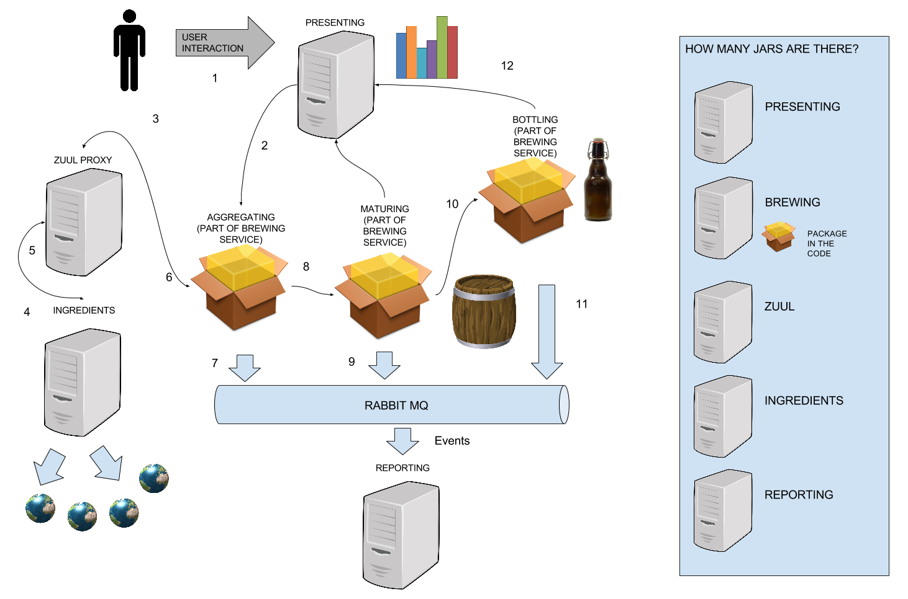

# Brewery

Ever wanted to brew your beer using microservices? This repository will allow you to do so!

## How does the brewery work?

Since pictures say more than words...



### Presenting service (point of entry to the system)

- Go to the presenting service (http://localhost:9091) and order ingredients
- A request from the presenting service is sent to the aggregating service when order is placed
- A "PROCESS-ID" header is set and will be passed through each part of beer brewing

### Aggregating service

- Service contains a warehouse ("database") where is stores the ingredients
- Basing on the order placed it will contact the external services to retrieve the real ingredients
- You have to have all 4 ingredients reach their threshold (1000) to start maturing the beer
- Once the threshold is met the application sends a request to the maturing service
- Each time a request is sent to the aggregating service it returns as a response its warehouse state

### Maturing service

- It receives a request with ingredients needed to brew a beer
- The brewing process starts thanks to the `Thread.sleep` method
- Once it's done a request to the bottling service is sent with number of worts
- Presenting service is called to update the current status of the beer brewing process

### Bottling service

- Waits some time to bottle the beer
- Presenting service is called to update the current status of the beer brewing process

## Project structure

```
├── acceptance-tests (code containing acceptace-tests of brewery)
├── aggregating      (service that aggregates ingredients)
├── bottling         (service that bottles the beer)
├── common           (common code for the services)
├── gradle           (gradle related stuff)
├── img              (the fabulous diagram of the brewery)
├── maturing         (service that matures the beer)
├── presenting       (UI of the brewery)
└── zookeeper        (embedded zookeeper)
```

## How to build it?

```
./gradlew clean build
```

## How to build one module?

E.g. `aggregating` module

```
./gradlew aggregating:clean aggregating:build
```

## How to run it?

### Using Docker

Create the Dockerfiles. By default Zipkin integration is disabled.

```
./gradlew clean docker --parallel
```

And run docker compose

```
docker-compose up
```

This will build and run all the apps from jars. Also Zookeeper will be set up automatically.

To remove the containers just type

```
docker-compose rm -f
```

### Using Gradle with embedded Zookeeper

To run it all without local Zipkin server and with an embedded Zookeeper server just execute:

```
./gradlew bootRun -Dspring.profiles.active=dev --parallel
```

Your logs will be visible in the console and in the respective `build/logs/application.log` folder.

## How to run a single module with embedded Zookeeper?

To run a single module just execute (e.g. `presenting` module):

```
./gradlew presenting:bootRun -Dspring.profiles.active=dev
```

## How to test it?

You can check this script: https://github.com/spring-cloud/spring-cloud-zookeeper/blob/master/scripts/runAcceptanceTests.sh

In general you need to:
- boot up all the apps
- run the tests of the `accepatance-tests` project

The easiest way is to:

Build the docker files and boot up the apps.

```
./gradlew clean build docker --parallel
docker-compose up -d
```
Once their up just run the script (`presenting.url` has to point to the url of your booted up container):

```
 bash -e runAcceptanceTests.sh -Dspring.zipkin.enabled=false -Dspring.cloud.zookeeper.maxRetries=5 -Dpresenting.url=$url:9091
```

## Authors

The code is ported from https://github.com/uservices-hackathon

The authors of the code are:
- Marcin Grzejszczak (marcingrzejszczak)
- Tomasz Szymanski (szimano)
