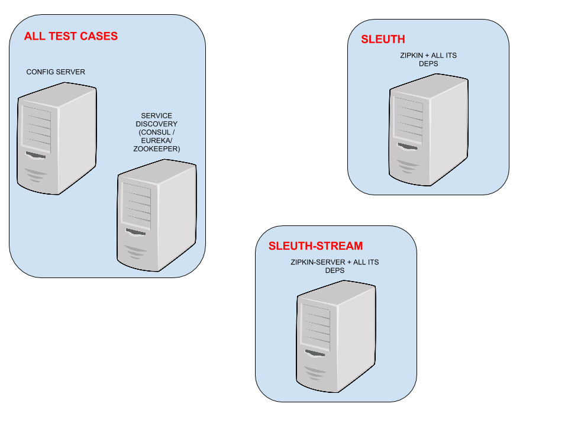
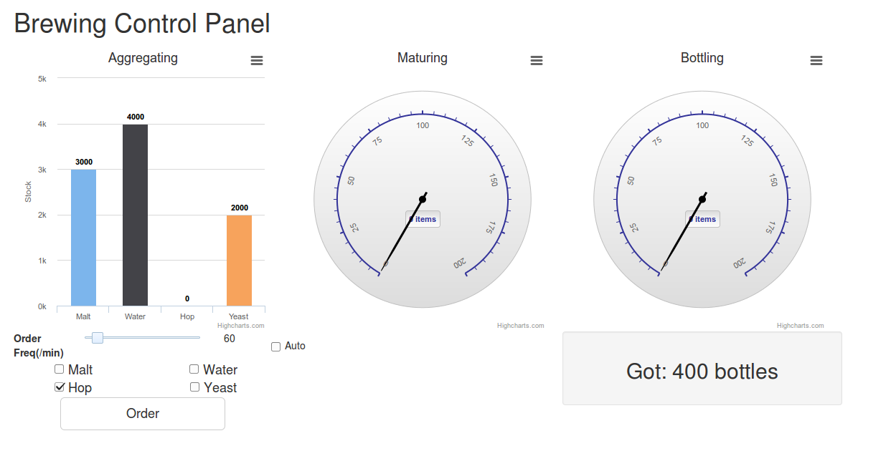

[](https://travis-ci.org/spring-cloud-samples/brewery)

# Brewery

Ever wanted to brew your beer using microservices? This repository will allow you to do so!

This repository is used throughout the Spring Cloud libraries builds as end to end testing set up. Check
[Acceptance Tests Readme](acceptance-tests/README.md) for more information.

## How does the brewery work?

Since pictures say more than words...

Here is the business flow of the app. Below you'll see more detailed explanation with numbers corresponding
to the numbers in the diagram


And here additional tech related applications:



And here how the flow of apps look like (screenshot taken from Zipkin)


### Presenting service (point of entry to the system)

Here is the UI



- Go to the presenting service (http://localhost:9991) and order ingredients **(1)**
- A request from the presenting service is sent to the aggregating service when order is placed **(2)**
- A "PROCESS-ID" header is set and will be passed through each part of beer brewing

### Brewing service

Brewing service contains the following functionalities:

#### Aggregating

- Service contains a warehouse ("database") where is stores the ingredients
- Basing on the order placed it will contact the Zuul proxy to fetch ingredients **(3)**
- Once the ingredients have been received an event is emitted **(7)**
- You have to have all 4 ingredients reach their threshold (1000) to start maturing the beer 
- Once the brewing has been started an event is emitted **(7)**
- Once the threshold is met the application sends a request to the maturing service **(8)**
- Each time a request is sent to the aggregating service it returns as a response its warehouse state

#### Maturing

- It receives a request with ingredients needed to brew a beer
- The brewing process starts thanks to the `Thread.sleep` method
- Once it's done an event is emitted **(9)** 
- And a request to the bottling service is sent with number of worts **(10)**
- Presenting service is called to update the current status of the beer brewing process

#### Bottling

- Waits some time to bottle the beer
- Once it's done an event is emitted **(11)** 
- Presenting service is called to update the current status of the beer brewing process **(12)**

### Ingredients Service

- Returns a fixed value of ingredients **(5)**

### Reporting Service

- Listens to events and stores them in the "database"

### Zuul proxy

- Proxy over the "adapters" to external world to fetch ingredients
- Routes all requests to the respective "ingredient adapter" **(4)**
- For simplicity we have one ingredient adapter called "ingredients" that returns a stubbed quantity
- Returns back the ingredients to the aggregating **(6)**

## Project structure

```
├── acceptance-tests (code containing acceptace-tests of brewery)
├── brewing          (service that creates beer - consists of aggregating, maturing, bottling functionalities)
├── common           (common code for the services)
├── docker           (docker scripts for additional apps - e.g. graphite)
├── config-server    (set up for the config server)
├── eureka           (Eureka server needed for Eureka tests)
├── git-props        (properties for config-server to pick)
├── gradle           (gradle related stuff)
├── img              (the fabulous diagram of the brewery)
├── ingredients      (service returns ingredients)
├── presenting       (UI of the brewery)
├── reporting        (service that listens to events)
├── zipkin-server    (Zipkin Server for Sleuth Stream tests)
├── zookeeper        (embedded zookeeper)
└── zuul             (Zuul proxy that forwards requests to ingredients)
```

## How to build it?

```
./gradlew clean build
```

## How to build one module?

E.g. `brewing` module

```
./gradlew brewing:clean brewing:build
```

## How to run it?

### Prerequisite

YOU NEED DOCKER-COMPOSE INSTALLED TO RUN THE BREWERY!

### Running Brewery

The easiest way is to:

* GO to the cloned `brewery` where you have the `runAcceptanceTests.sh` script (which in fact is already a symbolic link to `acceptance-tests/scripts/runDockerAcceptanceTests.sh`
 for your convenience)
* You can execute that script with such options
    * `-t` what do you want to test (`EUREKA`, `ZOOKEEPER`, `CONSUL`, `SLEUTH`, `SLEUTH_STREAM`)
    * `-v` in which version of the BOM (defaults to `Brixton.BUILD-SNAPSHOT`)
    * `-h` where is your docker host? (defaults to '127.0.0.1' - provide your docker-machine host here)
    * `-r` is brewery repo already in place and needs to be reset? (defaults to `not` resetting of repo)
    * `-k` should the apps and all running docker containers be killed after the tests are executed? pass `-k` to turn on (defaults to `not` killing the apps)
    * `-n` should the apps and all running docker containers be killed now and nothing else should happen? pass `-n` to turn on (defaults to `not` doing that)
    * `-x` should the apps be booted no tests should be ran? pass `-x` to turn on (defaults to `not` doing that)
    * `-s` should the building of apps be skipped? pass `-s` to turn on (defaults to `no` - the apps will be cleaned and built)
* For more options just run `runAcceptanceTests.sh` without any options or with `--help` switch

Once you run the script, the brewery app will be cloned, built with proper lib versions and proper tests
will be executed.

You can run this script to have the setup done for you in no time (example for SLEUTH tests execution):

```
git clone https://github.com/spring-cloud-samples/brewery.git
cd brewery
bash runAcceptanceTests.sh -t SLEUTH
```

### Examples

#### I want to just run all the apps and have fun

Execute:

```
bash runAcceptanceTests.sh -x
```

#### I want to just run all the apps with Eureka and have fun

Execute:

```
bash runAcceptanceTests.sh -x -t EUREKA
```

#### I want to run end to end tests of Consul and kill all the apps after the tests finish

Execute:

```
bash runAcceptanceTests.sh -t CONSUL -k
```

#### I want to run end to end tests of Consul on my docker-machine (ip. 1.2.3.4) and kill all the apps after the tests finish

Execute:

```
bash runAcceptanceTests.sh -t CONSUL -k -h 1.2.3.4
```

#### I want to run end to end tests of Consul, kill all the apps after the tests finish and skip build

Execute:

```
bash runAcceptanceTests.sh -t CONSUL -k -s
```

#### I just want to kill all the brewery related apps

Execute:

```
bash runAcceptanceTests.sh -n
```


## How to run a single module?

To run a single module just execute (e.g. `presenting` module):

```
./gradlew presenting:bootRun -Dspring.profiles.active=dev
```

## Authors

The code is ported from https://github.com/uservices-hackathon

The authors of the initial version of the code are:
- Marcin Grzejszczak (marcingrzejszczak)
- Tomasz Szymanski (szimano)
